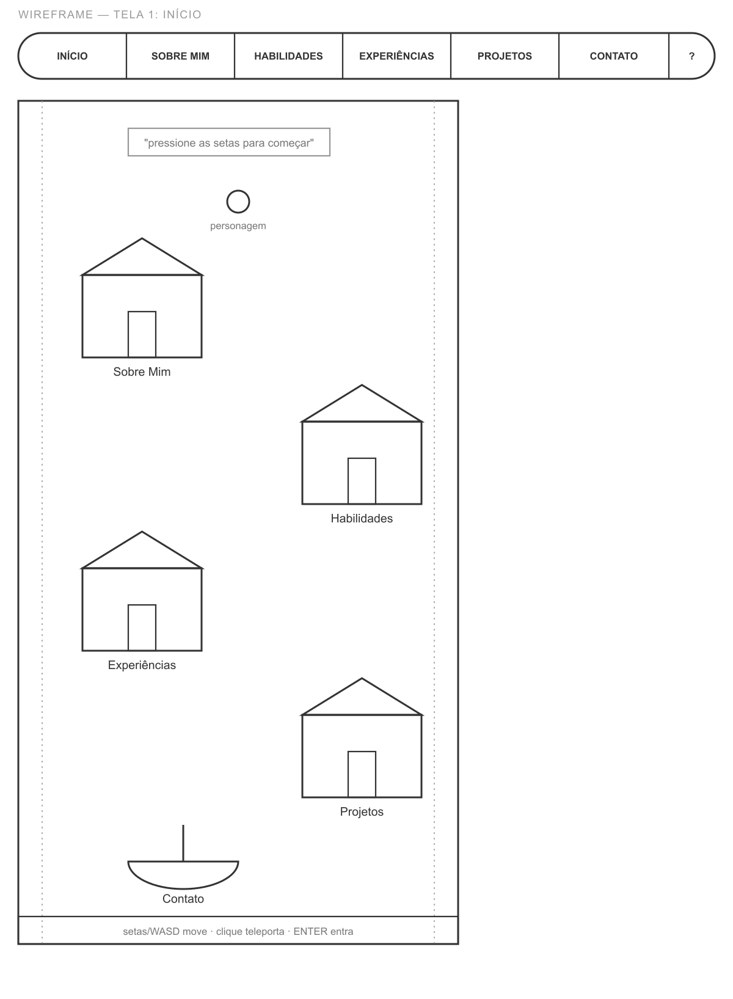
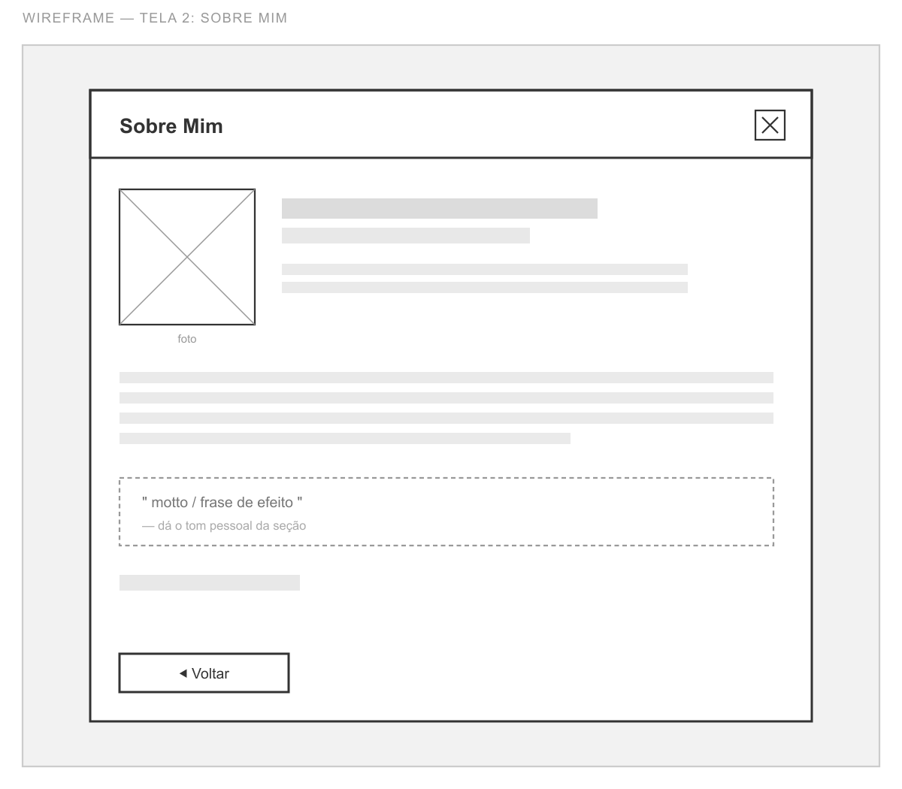
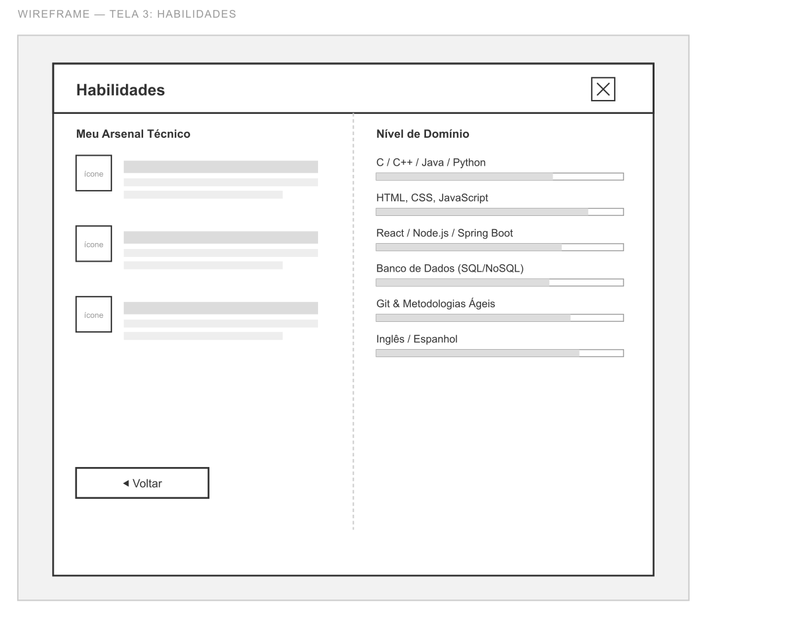
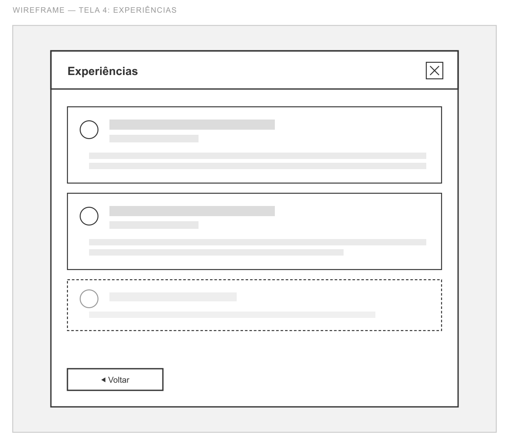
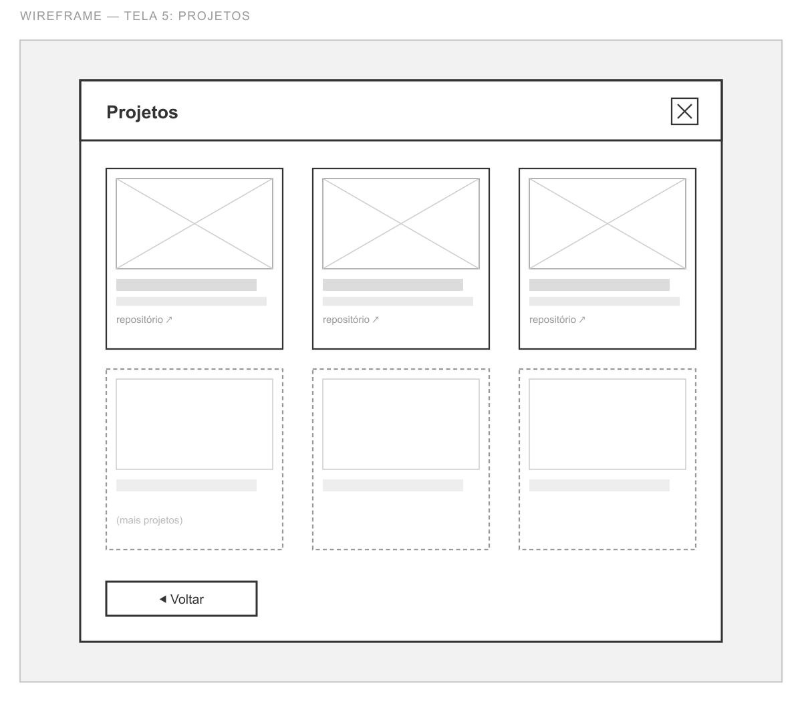
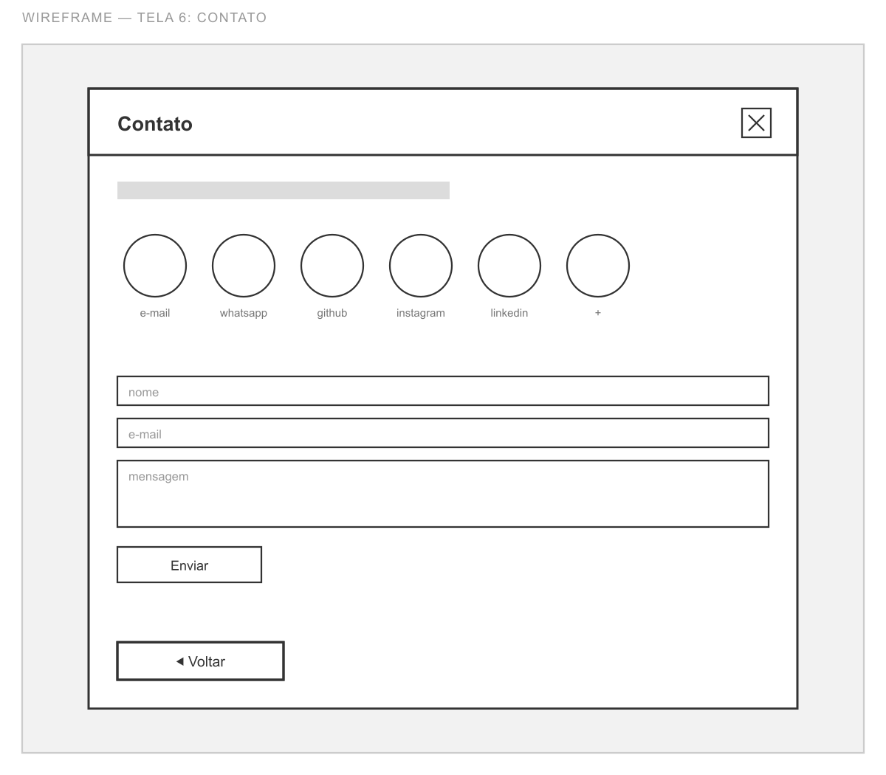
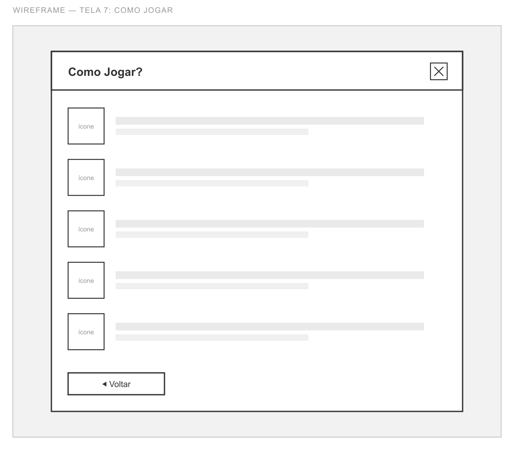
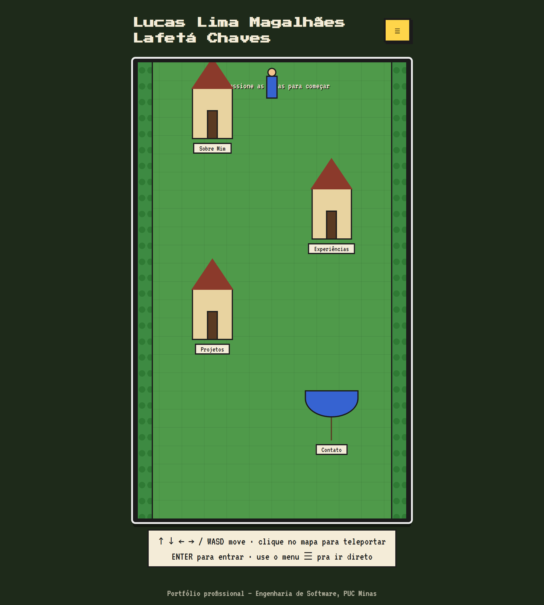
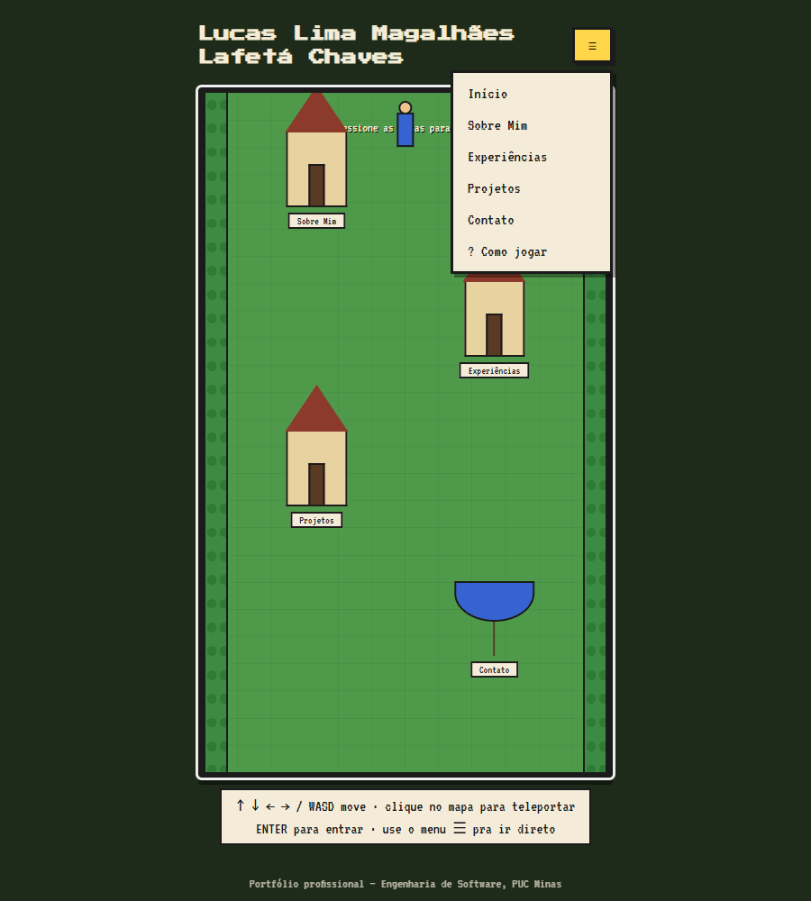
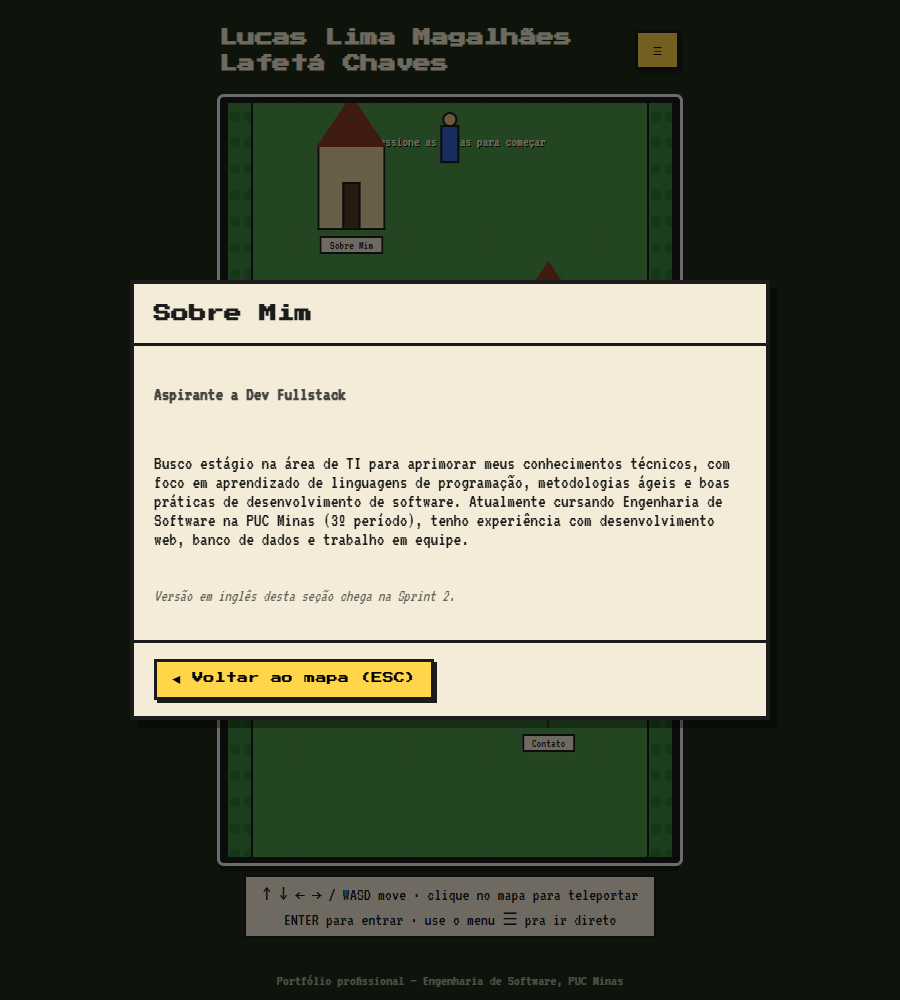

# Portfólio - Lucas Lafetá

Portfólio profissional desenvolvido para a disciplina de Projeto de Software (Engenharia de
Software, PUC Minas). Esta entrega corresponde à Sprint 1: planejamento, wireframes e o protótipo
inicial de front-end, com a estrutura incial já implementada.

## Ideia do projeto

O portfólio é apresentado como um mapa explorável, no estilo dos jogos antigos de Game Boy: o
visitante controla um personagem que anda pelo mapa e entra em uma "casinha" para acessar cada
seção — Sobre Mim, Habilidades, Experiências, Projetos e Contato (essa última é um barco, não uma
casa). Habilidades é uma seção extra além das exigidas (Sobre Mim, Projetos, Experiências e
Contato).

## Tecnologias previstas

- **[React](https://react.dev/) 19** — biblioteca de interface, usada pra estruturar o mapa e as
  seções em componentes.
- **[Vite](https://vitejs.dev/) 6** — build tool e servidor de desenvolvimento (`npm run dev` /
  `npm run build`).
- **TypeScript** — tipagem estática pros dados do currículo e pelas props dos componentes.
- **CSS puro** — para obter controle total do visual pixelado do mapa, sem depender
  de classes utilitárias já prontas.
- **[Node.js](https://nodejs.org/)** (v18+) e **npm** — ambiente e gerenciador de pacotes.

## Estrutura inicial do site

O site tem uma tela de início (o mapa) e cinco seções acessadas a partir dela: Sobre Mim,
Habilidades, Experiências, Projetos e Contato. Cada seção abre por cima do mapa, com um jeito de
voltar (botão ou tecla Esc), então a navegação é: **Início → Seção → Início**, sem precisar de
páginas separadas.

No código, isso fica em `src/`: `components/` tem as peças reutilizáveis do mapa (`MapScene`,
`House`, `Player`, `NavMenu`), `views/` tem o conteúdo de cada seção (`SobreMimView`,
`ProjetosView`, `ExperienciasView`, `ContatoView`, `HelpView`), `data/` cuida do acesso aos dados
(`useResumeData`) e `types.ts` guarda os contratos de tipo usados pelas outras camadas. `App.tsx`
só orquestra: decide qual view mostrar, sem lógica própria.

```
├── docs/
│   └── wireframes/       # wireframes, uma imagem por tela
├── public/
│   └── resumeData.json   # dados do currículo (nome, bio, projetos, experiências, contato)
├── src/
│   ├── components/       # MapScene, House, Player, NavMenu
│   ├── data/             # hook de carregamento do resumeData.json
│   ├── views/            # telas de cada seção (Sobre, Projetos, Experiências, Contato, Ajuda)
│   ├── App.tsx            # componente raiz (mapa + seção ativa)
│   ├── main.tsx
│   ├── index.css
│   └── types.ts
├── index.html
├── package.json
└── vite.config.ts
```

## Wireframes

Wireframes de média fidelidade, uma tela por seção, no padrão de wireframe, foi utilizado a ferrramente web Miro (caixas,
placeholders de imagem e texto, sem cor) para a criação dos mesmos, sendo eles usados para planejar a estrutura antes da implementação. (em
`docs/wireframes/`):

**Tela 1 — Início (menu + mapa)**


**Tela 2 — Sobre Mim**


**Tela 3 — Habilidades**


**Tela 4 — Experiências**


**Tela 5 — Projetos**


**Tela 6 — Contato**


**Tela 7 — Como Jogar**


## Protótipo (capturas de tela)

Essas são telas reais do protótipo já rodando, pra mostrar que o que tá nos wireframes de fato começou a ser implementado conforme a criação da estrutura incial:

**Mapa**


**Menu de navegação aberto**


**Seção "Sobre Mim" aberta**


## O que ainda falta

**Sprint 2**
- Página "Sobre Mim" com versões em português e inglês.
- Página "Projetos" com timeline dinâmica.
- Página "Experiências" com dados organizados.
- Página "Contato" com ícones e formulário funcional (envio de e-mail).
- Validações básicas e responsividade.

**Sprint 3**
- Deploy completo (Render, Vercel, Heroku, Fly.io ou similar).
- Ajustes visuais e de usabilidade.
- Inserção de imagens/GIFs dos projetos em execução.
- Instruções de uso e desenvolvimento no README final.

## Como rodar localmente

Pré-requisitos: [Node.js](https://nodejs.org/) (v18+).

```bash
npm install
npm run dev
```

Abra `http://localhost:5173` no navegador.

Para gerar a versão de produção:

```bash
npm run build
npm run preview
```

## Controles

- `↑ ↓ ← →` ou `W A S D`: mover o personagem
- Clique no mapa: teleporta o personagem até o ponto clicado
- `Enter`: entrar na casinha/barco mais próximo
- `Esc`: voltar ao mapa
- Ícone `☰` no cabeçalho: abre o menu com atalho direto pra cada seção

## Link do site publicado

[lucas-lafeta-dev.vercel.app](https://lucas-lafeta-dev.vercel.app)

O deploy final, já com esta versão em React + Vite no ar, sendo entrega somente da Sprint 3.
